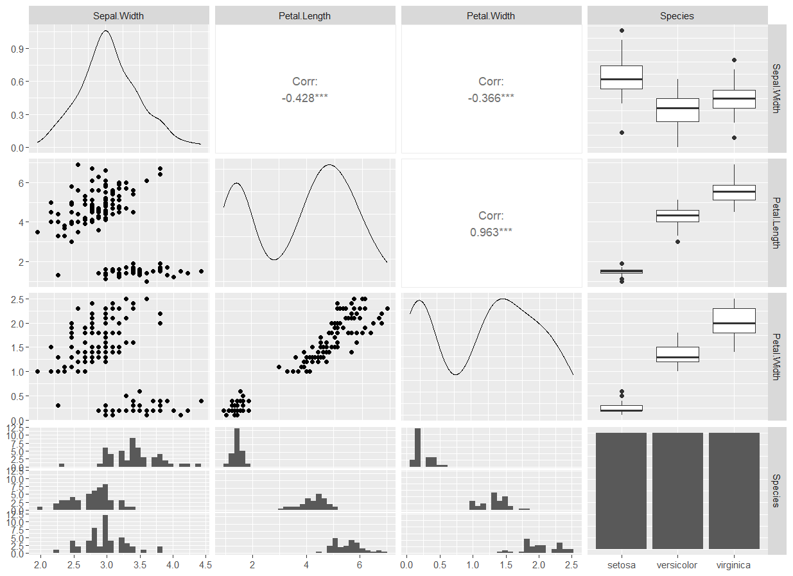

```{r setup, include=FALSE}
# 全局设置。运行代码；图片居中；大小为70%比例。
knitr::opts_chunk$set(echo = TRUE, 
                      fig.align = "center", 
                      out.width='70%')
# 注意：此设置要放在最后。防止图片里中文乱码。
pdf.options(height=10/2.54, width=10/2.54, family="GB1") 
```

# 摘要 {.unnumbered}

这里可以生成一段伪摘要。`{-}`即`{.unnumbered}`代表不编号。但是会在目录里生成这一段摘要。

可以将toc设置为false，不生成目录，把上面的abstract删掉，再使用`\tableofcontents`手动在任意位置生成目录。这样就可以在目录前加一个不编号的section作为摘要。但这种情况适用于生成pdf，在html时要慎重。关键词也可以解决啦。

**关键词：折腾，折腾，*English* **

\newpage 
\tableofcontents

\newpage
\listoffigures
\addcontentsline{toc}{section}{插图}

\listoftables
\addcontentsline{toc}{section}{表格}

\newpage

# (PART) 首个部分 {.unnumbered}

首个部分的内容。*倾斜*用一对星号，**加粗**用两对星号。好像并没有真的加粗或倾斜，而是了换字体。

# (PART) 另一个部分 {.unnumbered}

另一个部分的内容。PART和APPENDIX标题不能设置标签。也可以引用附录\@ref(app1)和\@ref(app1-1)的内容。

# 简介 {#intro}

下面是引用环境`>`。

> 这是基于北京大学李东风老师提供的模板进行改造而来，改造详情见`Modified_Record.txt`文件。[^index-1]

[^index-1]: 加个脚注试一下

# 测试一下章节引用功能 {#sec1-sub1}

我们有第\@ref(intro)章，第\@ref(usage-writing-fig)节。所有的内容都在`index.Rmd`中。标签仅用英文大小写字母和减号。

# 编写自己的内容 {#usage-writing}

## 图形自动编号 {#usage-writing-fig}

用R代码段生成的图形，只要具有代码段标签，且提供代码段选项`fig.cap="图形的说明文字"`，就可以对图形自动编号，并且可以用如`\@ref(fig:label)`的格式引用图形。

```{r fig1-1, fig.cap="图形说明文字"}
plot(1:10, main="程序生成的测试图形")
```

如图\@ref(fig:fig1-1)，引用中的`fig:`是必须的。在通过LaTeX转换的PDF结果中，图形是浮动的。

如果是已有的图形文件，
可以在一个单独的R代码段中用命令插图，如图\@ref(fig:fig1-2)。用代码段的fig.with和fig.height选项指定作图的宽和高（英寸），
用out.width和out.height选项指定在输出中实际显示的宽和高，
实际显示的宽和高如果使用如"90%"这样的百分数单位则可以自动适应输出的大小。

```{r fig1-2, out.width='80%', fig.align="center", fig.cap="插入已有图片"}

```

当一个代码块生成多个图片时，R Markdown会把它拆分成多个代码块，
每个代码块生成一个图片。在R的代码块选项中设置`out.width='50%'`,`fig.show='hold'`就可获得二个图形的并置，如图\@ref(fig:fig1-3)。（有时候会失效？）

在R的代码块选项中设置`out.width='90%'`,`fig.show='hold'`
就可获得二个图形的并置，如图\@ref(fig:fig1-4)。

```{r fig1-3, out.width='50%', fig.show='hold', fig.cap="并置图片"}
plot(pressure, pch = 19, type = "b")
plot(cars, pch = 19)
```

```{r fig1-4, out.width='90%', fig.show='hold', fig.cap="(ref:long-cap)"}
knitr::include_graphics(c("figures/fig2.png", "figures/fig2.png"))
```

(ref:long-cap) 这是堆叠图片。**很长的说明文字**。

有些插图会伴随很长的说明文字，但是其中的Markdown特有的格式在转换LaTeX时不一定支持，而且在代码段选项中写太长的文字说明也是的程序难以辨认。所以，可以使用文字引用的方式：在单独的一段中，用如下格式定义一段可引用的文字内容：

`(ref:mylabel)` 这里用实际的文字内容代替，不允许换行，不能分段。

其中mylabel是自己定义的仅由英文大小写字母、数字和减号组成的引用标志符。在需要使用这段文字的位置，用`(ref:mylabel)`这种格式引用。
注意定义和引用都是用的`(ref:mylabel)`语法。如图\@ref(fig:fig1-4)。

(ref:text) **这是用markdown格式加粗的文字**

既然说到这儿了，那就顺便介绍一下文字引用吧。用上面的方式定义的文字不显示，只有在引用时才显示，比如：(ref:text)。

## 表格自动编号 {#usage-writing-tab}

用R代码`knitr::kable()`生成的表格，只要具有代码段标签，并且在`knitr::kable()`调用时加选项`caption="表格的说明文字"`，就可以对表格自动编号，并且可以用如`\@ref(tab:label)`的格式引用表格。

```{r tab1-1}
knitr::kable(
  head(mtcars[, 1:5], 10), booktabs = TRUE,
  caption = 'mtcars数据的前5行.'
)
```

如表\@ref(tab:tab1-1),引用中的`tab:`是必须的。在通过LaTeX转换的PDF结果中，表格是浮动的。

当 `kable()`
的第一个参数是包含多个数据框的列表时，它会生成多个并排放置的表格。例如，表\@ref(tab:tab1-2)

```{r tab1-2}
knitr::kable(
  list(iris[1:3,], iris[4:6,]),
  caption = '两张表并排放置',
  booktabs = TRUE, valign = 't'
)
```

## 项目列表 {#item}

-   无序号
-   无序号
-   无序号

1.  有序号
    1.  嵌套一下
    2.  再嵌套一下
2.  有序号
    -   无序嵌套
    -   无序嵌套
3.  有序号

## 数学公式编号 {#usage-writing-math}

可以用`\tag{标号}`命令增加人为的公式编号，如式\@ref(eq:eq-0)。 
$$
y = f(x) \tag{*} (\#eq:eq-0) 
$$

需要各行都编号且需要对齐的公式，直接写在`\begin{align}`和`\end{align}`之间，
不需要编号的行在末尾用`\nonumber`标注。需要编号的行用`(\#eq:mylabel)`添加自定义标签，
如不让第一行带编号，第二三行为式\@ref(eq:eq-1)和\@ref(eq:eq-2)。


\begin{align}
\Sigma =&  (\sigma_{ij})_{n\times n} \nonumber \\
=& E[(\boldsymbol{X} - \boldsymbol{\mu}) (\boldsymbol{X} - \boldsymbol{\mu})^T ]
(\#eq:eq-1) \\
\alpha = \frac{\beta}{\gamma} (\#eq:eq-2)
\end{align}

如果不需要按等号对齐，只需罗列数个公式，gather
是一个很好用的环境。用`\notag`去掉编号。
如式\@ref(eq:eq-3)，\@ref(eq:eq-4)和\@ref(eq:eq-5)。


\begin{gather}
    a = b + c  (\#eq:eq-3) \\
    d = e + f + g (\#eq:eq-4) \\
    h + i = j + k \notag \\
    l + m = n   (\#eq:eq-5)
\end{gather}

多个公式组在一起公用一个编号，编号位于公式的居中位置。 amsmath
宏包提供了诸如aligned、gathered 等环境，与equation环境套用。
如果不想要编号，则用`\begin{equation*}`，或者直接放在`\[ \]`内。如式\@ref(eq:eq-6)。


\begin{equation}
    \begin{aligned}
        a &= b + c \\
        d &= e + f + g \\
        h + i &= j + k \\
        l + m &= n
    \end{aligned}
    (\#eq:eq-6)
\end{equation}

amsmath 宏包的multline 环境提供了书写折行长公式的方便环境。它允许用`\\`
折行，将
公式编号放在最后一行。多行公式的首行左对齐，末行右对齐，其余行居中。如式\@ref(eq:eq-7)。

\begin{multline}
    a + b + c + d + e + f
    + g + h + i \\
    = j + k + l + m + n\\
    = o + p + q + r + s\\
    = t + u + v + x + z   
    (\#eq:eq-7)
\end{multline}

可以用array 环境排版各种矩阵。amsmath 宏包提供了多种排版矩阵的
环境，包括不带定界符的matrix，以及带各种定界符的矩阵pmatrix等。
`\[ \]`默认不带编号，而equation带编号，如$X=\text{矩阵}$和式\@ref(eq:eq-8)
\[
\mathbf{X} = \left(
\begin{array}{cccc}
    x_{11} & x_{12} & \ldots & x_{1n}\\
    x_{21} & x_{22} & \ldots & x_{2n}\\
    \vdots & \vdots & \ddots & \vdots\\
    x_{n1} & x_{n2} & \ldots & x_{nn}\\
\end{array} \right) 
\]

```{=tex}
\begin{equation}
\begin{matrix}
    1 & 2 \\ 3 & 4
\end{matrix} \qquad
\begin{bmatrix}
    x_{11} & x_{12} & \ldots & x_{1n}\\
    x_{21} & x_{22} & \ldots & x_{2n}\\
    \vdots & \vdots & \ddots & \vdots\\
    x_{n1} & x_{n2} & \ldots & x_{nn}\\
\end{bmatrix} (\#eq:eq-8)
\end{equation}
```

## 文献引用与文献列表

将所有文献用bib格式保存为一个`.bib`文献库，如模板中的样例文件`mybib.bib`。

为了引用某一本书或者文章，用如：参见 @Wensheng2022
和[@Wichmann1982:RNG]。 直接用 @MWP06-HighStat
可以生成带名的文献（`@Wensheng2022`前后要加个空格以便识别），
加个中括号[@QGCZ2011:StochProc]
则是到右上角去。没引用的文献不会打印出来。

被引用的文献将出现在一章末尾以及全书的末尾，对PDF输出则仅出现在全书末尾。

# 定理等环境 {#therorom}

LaTeX 命令 `\newpage`
可以在文档中插入一个分页符。如果只想插入一条水平的分割线而不分页，可以插入三个减号
`---`。

------------------------------------------------------------------------

定理、引理、命题、例题等， 使用特殊的markdown代码格式， 以三个冒号开头，
以三个冒号结尾， 在开头的三个反单撇号后面空格后写`{.theorem}`表示定理。
在`.theorem`后面， 可以用空格分隔后写一个定理的自定义标签，
标签以`#`开头，由字母、数字、减号组成，
`#`号作为标签的开头标志但不作为标签的一部分。
可以用`name="定理名称"`指定一个显示的定理名。

\newpage

设某个定理的自定义标签是`#mythlabel`，
则可以用如`\@ref(thm:mythlabel)`引用此定理的编号，
编号是在每一章内从头编号的。
编号有自动生成的链接。当定理或例子内有列表时， 一定注意列表前后要空行，
否则会导致嵌套错误。

::: {#norlim-weakconv .theorem name="弱收敛"}
$\xi_n$依分布收敛到$\xi$，
当且仅当对任意$\mathbb R$上的一元实值连续函数$f(\cdot)$都有 
$$
  E f(\xi_n) \to E f(\xi), \ n \to \infty .
$$
:::

::: {#lem-1 .lemma name="引理示例"}
引理的示例
:::

::: {#cor-1 .corollary name="推论示例"}
推论的示例
:::

::: {#prp-1 .proposition name="命题示例"}
命题的示例
:::

::: {#cnj-1 .conjecture name="推测示例"}
推测的示例
:::

::: {#def-1 .definition name="定义示例"}
定义的示例
:::

::: {#exm-1 .example name="例子示例"}
例子的示例
:::

::: {#exr-1 .exercise name="练习示例"}
练习的示例
:::

::: {#hyp-1 .hypothesis name="假设示例"}
假设的示例
:::

这些示例见\@ref(thm:norlim-weakconv)，\@ref(lem:lem-1)，\@ref(cor:cor-1)，\@ref(prp:prp-1)，
\@ref(cnj:cnj-1)，\@ref(def:def-1)，\@ref(exm:exm-1)，\@ref(exr:exr-1)，\@ref(hyp:hyp-1)。总结在表\@ref(tab:mytab)中。注意下面这个HTML表格，它的引用要注意下面的写法。

| 环境名      |  默认显示名 | 标签前缀 |
|:------------|------------:|---------:|
| theorem     |     Theorem |      thm |
| lemma       |       Lemma |      lem |
| corollary   |   Corollary |      cor |
| proposition | Proposition |      prp |
| conjecture  |  Conjecture |      cnj |
| definition  |  Definition |      def |
| example     |     Example |      exm |
| exercise    |    Exercise |      exr |
| hypothesis  |  Hypothesis |      hyp |

: (#tab:mytab) 定理类环境的说明

还有几个特殊的，比如证明、注和解。

::: proof
证明的示例
:::

::: remark
注释的示例
:::

::: solution
解的示例
:::

# 代码块的设置 {#usage-code}

用Rmd生成代码特别方便。默认是三个TRUE，既运行代码，又显示代码，并且显示运行结果。
列出一些常用的块选项（只写非默认情形）：

-   `eval = FALSE`：只显示代码，不运行代码
-   `echo = FALSE`：不显示代码，只显示运行结果
-   `include = FALSE`：运行代码，不显示代码和运行结果
-   `results = "hide"`：隐藏输出结果
-   `tidy = TRUE`：整洁代码格式
-   `message = FALSE`：不输出提示信息，比如包的载入信息
-   `warning = FALSE`：不输出警告
-   `error = TRUE`：忽略错误，继续编译文档

## 不运行代码 {#usage-code-1}

不运行代码自然没有输出结果。用`eval = FALSE`控制不运行代码（默认为`TRUE`运行）。
只需要再用`echo`控制是否显示代码（默认为`TRUE`，即显示）。

### 有代码（不运行） {#codes-1}

`echo = TRUE`，显示代码，不需要特地指定。只需要`eval = FALSE`。见\@ref(codes-1)。没有图或表的话，没法引用代码块。

```{r rmd-codes-1, eval=FALSE}
tinytex::is_tinytex() # 不运行代码。自然没有输出结果。显示代码。
```

### 无代码（不运行） {#codes-2}

`echo = FALSE`，不显示代码，看不到啦。记得要`eval = FALSE`。见\@ref(codes-2)。

```{r rmd-codes-2, eval=FALSE, echo=FALSE}
tinytex::is_tinytex() # 不运行代码。自然没有输出结果。不显示代码。
```

## 运行代码 {#usage-code-2}

用`eval = TRUE`控制运行代码，即默认情况，不需要特地指定。

### 无代码，无结果（运行） {#codes-3}

不显示代码，不输出结果。用`include = FALSE`。
很适用于调包的时候，再加`message = FALSE`：不输出提示信息，比如包的载入信息。见\@ref(codes-3)。

```{r rmd-codes-3, include=FALSE, message = FALSE}
library(tidyverse) # 运行代码。不显示代码, 不输出结果。不输出提示信息。
```

### 有代码，有结果（运行） {#codes-4}

显示代码且显示结果，就是默认的啦。即`eval=TRUE`,
`echo=TRUE`。见\@ref(codes-4)。

```{r rmd-codes-4}
a = 1 + 2
print(paste0("a = ", a)) # 运行代码。显示代码，显示结果。
```

### 有代码，无结果（运行） {#codes-5}

显示代码，不显示结果。有默认的`echo = TRUE`。只需要再加一个`results = "hide"`来隐藏输出结果。见\@ref(codes-5)。

这里要注意，`results = "hide"`是隐藏文本输出（也可以使用`results = FALSE`），`fig.show='hide'`是隐藏图形输出。`fig.keep = "none"`
和 `fig.show = "hide"`
这两个选项是不同的，后者将生成图像文件，只是会隐藏它们，而前者则根本不会生成图像文件。

```{r rmd-codes-5, results = "hide"}
a = 1 + 2
print(paste0("a = ", a)) # 运行代码。显示代码，不显示结果。
```

### 无代码，有结果（运行） {#codes-6}

不显示代码，但显示结果。显示结果是默认的，不用调整。只需要把代码隐藏，即`echo = FALSE`。见\@ref(codes-6)。

```{r rmd-codes-6, echo = FALSE}
a = 1 + 2
print(paste0("a = ", a)) # 运行代码。不显示代码，显示结果。
```

## 其他事项 {#codes-other}

R Markdown
默认把源代码和输出放置在不同的容器中。如果想把输出和源代码放在一起，可以使用块选项
`collapse = TRUE`，例如下面的结果。`cache = TRUE`缓存运行结果，能加速后续再编译，但可能会导致一些问题，慎重使用。

```{r rmd-codes-7, collapse = TRUE}
1:10
```

------------------------------------------------------------------------

当设置块选项 `tidy = TRUE` 时， R 的源代码将被 formatR 包 (Xie 2022b)的
`tidy_source()` 函数重新格式化。R Markdown 默认设置 `tidy = FALSE`,
不会自动格式化代码。

```{r code-chaos, tidy=TRUE}
# 混乱的 R 代码...
a = 1+   1
x=1:10#有些使用者更喜欢用 '<-' 来作为赋值操作符
if(TRUE){
print('Hello world!') # 缩进 2 个空格
}
```

------------------------------------------------------------------------

默认情况下，R Markdown 会在文本输出的前面插入两个符号
`##`。但如果只是想调整前导符号，而仍然想将文本放在单独的块中，则可以通过块选项
`comment` 来实现。如果要删除 `##`，可以使用空字符串`comment=" "`。

`.numberLines`，可以用于为代码块添加行号。演示如下。注意，为了让
`html_document` 格式显示行号，需要在 YAML
元数据中使用任意非默认的高亮选项，例如 `hightlight: pygment`。

```{r codes-number, class.source='numberLines', eval=FALSE}
if (TRUE) {
  x <- 1:10
  x + 1
}
```

------------------------------------------------------------------------

对于 PDF 输出，如果对图像中的字体非常挑剔，可以使用 `dev = "tikz"`，
因为它提供了对LaTeX的原生支持，这意味着图像中的所有元素，
包括文本和符号，都可以通过 LaTeX 以高质量呈现。需要注意的是，R
的基础包实际上支持数学表达式，但它们不是通过 LaTeX 呈现的。

```{r code-high-quantity, dev = "tikz", cache = TRUE}
# 要用tex编译运行，太慢了，所以用cache缓存一下
par(mar = c(4, 4, 2, .1))
curve(dnorm, -3, 3, xlab = '$x$', ylab = '$\\phi(x)$',
      main = 'The density function of $N(0, 1)$')
text(-1, .2, cex = 3, col = 'blue',
  '$\\phi(x)=\\frac{1}{\\sqrt{2\\pi}}e^{\\frac{-x^2}{2}}$')
```

在一个报告中，往往会有一些运行起来很费时且很关键的代码块（如数据预处理等）。为了节省时间，可以考虑通过块选项
`cache = TRUE` 来缓存该代码块的结果。
当启用缓存时，如果一个代码块之前被执行过且之后没有任何变化时， knitr
将跳过这个代码块的执行，从而大大缩短编译所需的时间。
而当再次修改代码块时（如修改代码或块选项），之前的缓存将自动失效， 并且
knitr 将再次运行并缓存该代码块。

然而，天下没有免费的午餐，有的时候 knitr 会令缓存失效或是部分失效，
如外部文件内容的改变可能没有体现在报告中等等。
缓存的一个典型应用场景是保存和重新加载那些需要很长时间才能在代码块中
计算的 R 对象。需要注意的是，代码需要没有任何"副产物"，
否则建议不要进行缓存。例如在使用 options() 更改全局
R选项时，产生的更改不会被缓存。

必须要让 knitr 知道数据文件是否已被更改。一种方法是添加另一个块选项
`cache.extra = file.mtime('数据.csv')`，或者更严格的方式：`cache.extra = tools::md5sum('数据.csv')`。前者意味着如果文件的修改时间发生了变化，就需要使缓存失效。需要注意的是，不建议在文档中设置全局块选项
cache = TRUE，
因为缓存可能相当棘手。相反的，可以只在个别耗时很久的代码块上启用缓存，
这样并不会产生副产物。 

---

reticulate (Ushey, Allaire, and Tang 2022) 包提供了 R Markdown 中默认的
Python 引擎。要将 Python 代码块添加到 R Markdown文档中，
可以在代码块头部设置为```` ```{python} ````，例如：

```{python code-python}
print("Hello Python!")
```

Python 代码块支持部分 knitr 选项，比如 `echo = FALSE` 或 `eval = FALSE`
等。reticulate 包的一个重要特性是它允许在 Python 和 R
运行环境中传递对象。在 R 和 Python 代码块互相传递对象时，reticulate
包会自动地进行类型转换。例如 R 中的向量在 Python 中变为列表，R
中的列表在 Python 中变为字典，R 中的数据框 data.frame 类变为 Python 中
pandas 库支持的 DataFrame 类等。

------------------------------------------------------------------------

**注意**：最后一行用于生成文献目录标题，不要删去。如果想在最后添加 .bib
中的全部条目，不论是否引用，可以设置 YAML 中的 notice
属性。例如：`nocite: '@*'`。索引比较复杂，这里就不考虑了。

# (APPENDIX) 附录 {.unnumbered}

# 首个附录 {#app1}

首个附录的内容。

## 首个子附录 {#app1-1}

首个子附录的内容。

# 另一个附录 {#app2}

另一个附录的内容。

\newpage

`r if (knitr::is_html_output()) '# 参考文献 {-}'`
